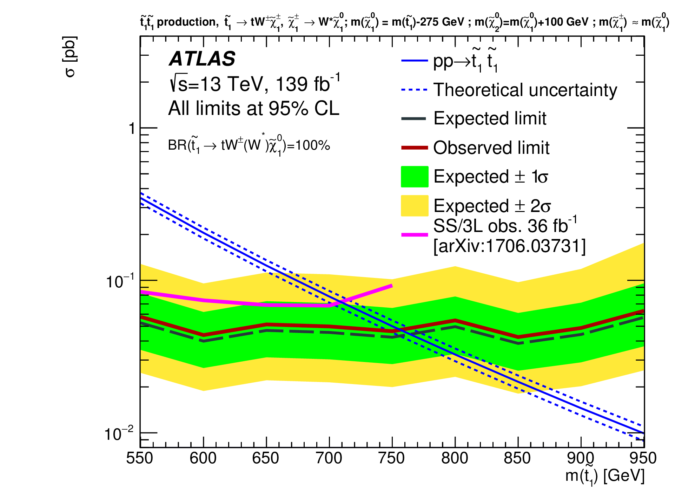

==================
Stops - EFT vs SMS
==================

Analyses Summary
================

ATLAS
*****

Summary
^^^^^^^

    

Analyses
^^^^^^^^

* `SUSY-2016-15 <http://atlas.web.cern.ch/Atlas/GROUPS/PHYSICS/PAPERS/SUSY-2016-15/>`_ (1709.04183)

  * A search for pair production of a scalar partner of the top quark in events with four or more jets plus missing transverse momentum is presented. An analysis of 36.1 fb−1 of s√=13 TeV proton--proton collisions collected using the ATLAS detector at the LHC yields no significant excess over the expected Standard Model background. To interpret the results a simplified supersymmetric model is used where the top squark is assumed to decay via t̃ 1→t(∗)χ̃ 01 and t̃ 1→bχ̃ ±1→bW(∗)χ̃ 01, where χ̃ 01 (χ±1) denotes the lightest neutralino (chargino). Exclusion limits are placed in terms of the top-squark and neutralino masses. Assuming a branching ratio of 100\% to tχ̃ 01, top-squark masses in the range 450--950 GeV are excluded for χ̃ 01 masses below 160 GeV. In the case where mt̃ 1∼mt+mχ̃ 01, top-squark masses in the range 235--590 GeV are excluded.

* `CONF-2019-017 <https://atlas.web.cern.ch/Atlas/GROUPS/PHYSICS/CONFNOTES/ATLAS-CONF-2019-017/>`_

  * A search for direct pair production of top squarks, the supersymmetric partner of the top quark, is presented. The search focuses on final states with one isolated electron or muon, multiple jets, and large missing transverse momentum. The analysis is performed using the Large Hadron Collider Run 2 proton-proton dataset at a centre-of-mass energy of s√=13TeV recorded by the ATLAS detector from 2015 to 2018, corresponding to an integrated luminosity of 139fb−1. One particular signal scenario is considered, characterised by the mass-splitting between the top squark and the lightest neutralino, where each top squark decays via a 3-body process to a b quark, a W boson, and a neutralino. No significant deviation from the predicted Standard Model background is observed, and limits at 95% confidence level on the supersymmetric benchmark model are set, excluding top squark masses up to 720GeV with neutralino masses up to 580GeV.

* `SUSY-2016-16 <https://atlas.web.cern.ch/Atlas/GROUPS/PHYSICS/PAPERS/SUSY-2016-16/>`_ (1711.11520)

  * The results of a search for the direct pair production of top squarks, the supersymmetric partner of the top quark, in final states with one isolated electron or muon, several energetic jets, and missing transverse momentum are reported. The analysis also targets spin-0 mediator models, where the mediator decays into a pair of dark-matter particles and is produced in association with a pair of top quarks. The search uses data from proton-proton collisions delivered by the Large Hadron Collider in 2015 and 2016 at a centre-of-mass energy of $\sqrt{s}=13$ TeV and recorded by the ATLAS detector, corresponding to an integrated luminosity of 36 fb$^{-1}$. A wide range of signal scenarios with different mass-splittings between the top squark, the lightest neutralino and possible intermediate supersymmetric particles are considered, including cases where the W bosons or the top quarks produced in the decay chain are off-shell. No significant excess over the Standard Model prediction is observed. The null results are used to set exclusion limits at 95% confidence level in several supersymmetry benchmark models. For pair-produced top-squarks decaying into top quarks, top-squark masses up to 940 GeV are excluded. Stringent exclusion limits are also derived for all other considered top-squark decay scenarios. For the spin-0 mediator models, upper limits are set on the visible cross-section.
  

* `SUSY-2016-17 <https://atlas.web.cern.ch/Atlas/GROUPS/PHYSICS/PAPERS/SUSY-2016-17/>`_ (1708.03247)

  * The results of a search for direct pair production of top squarks in events with two opposite-charge leptons (electrons or muons) are reported, using 36.1 fb$^{-1}$ of integrated luminosity from proton--proton collisions at $\sqrt{s}=13$ TeV collected by the ATLAS detector at the Large Hadron Collider. To cover a range of mass differences between the top squark $\tilde{t}$ and lighter supersymmetric particles, four possible decay modes of the top squark are targeted with dedicated selections: the decay $\tilde{t} \rightarrow b \tilde{\chi}_{1}^{\pm}$ into a $b$-quark and the lightest chargino with $\tilde{\chi}_{1}^{\pm} \rightarrow W \tilde{\chi}_{1}^{0}$, the decay $\tilde{t} \rightarrow t \tilde{\chi}_{1}^{0}$ into an on-shell top quark and the lightest neutralino, the three-body decay $\tilde{t} \rightarrow b W \tilde{\chi}_{1}^{0}$ and the four-body decay $\tilde{t} \rightarrow b \ell \nu \tilde{\chi}_{1}^{0}$. No significant excess of events is observed above the Standard Model background for any selection, and limits on top squarks are set as a function of the $\tilde{t}$ and $\tilde{\chi}_{1}^{0}$ masses. The results exclude at 95% confidence level $\tilde{\chi}_{1}^{0}$ masses up to about 720 GeV, extending the exclusion region of supersymmetric parameter space covered by previous searches.
  

* `EXOT-2016-27 <https://atlas.web.cern.ch/Atlas/GROUPS/PHYSICS/PAPERS/EXOT-2016-27/>`_ (1711.03301)

  * Results of a search for new phenomena in final states with an energetic jet and large missing transverse momentum are reported. The search uses proton--proton collision data corresponding to an integrated luminosity of 36.1 fb${}^{-1}$ at a centre-of-mass energy of 13 TeV collected in 2015 and 2016 with the ATLAS detector at the Large Hadron Collider. Events are required to have at least one jet with a transverse momentum above 250 GeV and no leptons ($e$ or $\mu$). Several signal regions are considered with increasing requirements on the missing transverse momentum above 250 GeV. Good agreement is observed between the number of events in data and Standard Model predictions. The results are translated into exclusion limits in models with pair-produced weakly interacting dark-matter candidates, large extra spatial dimensions, and supersymmetric particles in several compressed scenarios.

* `TOPQ-2016-10 <https://atlas.web.cern.ch/Atlas/GROUPS/PHYSICS/PAPERS/TOPQ-2016-10/>`_ (1903.07570)

  * A measurement of observables sensitive to spin correlations in tt¯ production is presented, using 36.1 fb−1 of pp collision data at s√=13 TeV recorded with the ATLAS detector at the Large Hadron Collider. Differential cross-sections are measured in events with exactly one electron and one muon with opposite-sign electric charge as a function of the azimuthal opening angle and the absolute difference in pseudorapidity between the electron and muon candidates in the laboratory frame. The azimuthal opening angle is also measured as a function of the invariant mass of the tt¯ system. The measured differential cross-sections are compared to predictions by several NLO Monte Carlo generators and fixed-order calculations. The observed degree of spin correlation is significantly higher than predicted by the generators used, but agrees well with the prediction of one of the fixed-order calculations. Using these leptonic observables, a search is performed for pair production of supersymmetric top squarks decaying into Standard Model top quarks and light neutralinos. Top squark masses between 170 and 230 GeV are largely excluded at the 95% confidence level for kinematically allowed values of the neutralino mass.

* `SUSY-2015-26 <https://atlas.web.cern.ch/Atlas/GROUPS/PHYSICS/PAPERS/SUSY-2016-26/>`_ (1805.01649)

  * A search for supersymmetric partners of top quarks decaying as $\tilde{t}_1\to c\tilde\chi^0_1$ and supersymmetric partners of charm quarks decaying as $\tilde{c}_1\to c\tilde\chi^0_1$, where $\tilde\chi^0_1$ is the lightest neutralino, is presented. The search uses 36.1 ${\rm fb}^{-1}$ $pp$ collision data at a centre-of-mass energy of 13 TeV collected by the ATLAS experiment at the Large Hadron Collider and is performed in final states with jets identified as containing charm hadrons. Assuming a 100% branching ratio to $c\tilde\chi^0_1$, top and charm squarks with masses up to 850 GeV are excluded at 95% confidence level for a massless lightest neutralino. For $m_{\tilde{t}_1,\tilde{c}_1}-m_{\tilde\chi^0_1} <$100 GeV, top and charm squark masses up to 500 GeV are excluded.
  
.. figure:: SUSY-2016-26_fig_06.png

* `EXOT-2015-03 <https://atlas.web.cern.ch/Atlas/GROUPS/PHYSICS/PAPERS/EXOT-2015-03/>`_ (1604.07773)

  * Results of a search for new phenomena in final states with an energetic jet and large missing transverse momentum are reported. The search uses proton--proton collision data corresponding to an   integrated luminosity of 3.2 fb−1 at s√=13 TeV collected in 2015 with the ATLAS detector at the Large Hadron Collider. Events are required to have at least one jet with a transverse momentum above 250 GeV and no leptons. Several signal regions are considered with increasing missing-transverse-momentum requirements between EmissT>250 GeV and EmissT>700 GeV. Good agreement is observed between the number of events in data and Standard Model predictions. The results are translated into exclusion limits in models with large extra spatial dimensions, pair production of weakly interacting dark-matter candidates, and the production of supersymmetric particles in several compressed scenarios.

* `SUSY-2015-02 <https://atlas.web.cern.ch/Atlas/GROUPS/PHYSICS/PAPERS/SUSY-2015-02/>`_ (1606.03903)

  * The results of a search for the stop, the supersymmetric partner of the top quark, in final states with one isolated electron or muon, jets, and missing transverse momentum are reported. The search uses the 2015 LHC pp collision data at a center-of-mass energy of s√=13 TeV recorded by the ATLAS detector and corresponding to an integrated luminosity of 3.2 fb−1. The analysis targets two types of signal models: gluino-mediated pair production of stops with a nearly mass-degenerate stop and neutralino; and direct pair production of stops, decaying to the top quark and the lightest neutralino. The experimental signature in both signal scenarios is similar to that of a top quark pair produced in association with large missing transverse momentum. No significant excess over the Standard Model background prediction is observed, and exclusion limits on gluino and stop masses are set at 95% confidence level. The results extend the LHC Run-1 exclusion limit on the gluino mass up to 1460 GeV in the gluino-mediated scenario in the high gluino and low stop mass region, and add an excluded stop mass region from 745 to 780 GeV for the direct stop model with a massless lightest neutralino. The results are also reinterpreted to set exclusion limits in a model of vector-like top quarks.
  
.. figure:: SUSY-2015-02_fig_08b.png
  

* `SUSY-2016-28 <https://atlas.web.cern.ch/Atlas/GROUPS/PHYSICS/PAPERS/SUSY-2016-28/>`_ (1708.09266)
  * A search for the supersymmetric partners of the Standard Model bottom and top quarks is presented. The search uses 36.1 fb$^{-1}$ of $pp$ collision data at $\sqrt{s}=13$ TeV collected by the ATLAS experiment at the Large Hadron Collider. Direct production of pairs of bottom and top squarks ($\tilde{b}_{1}$ and $\tilde{t}_{1}$) is searched for in final states with $b$-tagged jets and missing transverse momentum. Distinctive selections are defined with either no charged leptons (electrons or muons) in the final state, or one charged lepton. The zero-lepton selection targets models in which the $\tilde{b}_{1}$ is the lightest squark and decays via $\tilde{b}_{1} \rightarrow b \tilde{\chi}^{0}_{1}$, where $\tilde{\chi}^{0}_{1}$ is the lightest neutralino. The one-lepton final state targets models where bottom or top squarks are produced and can decay into multiple channels, $\tilde{b}_{1} \rightarrow b \tilde{\chi}^{0}_{1}$ and $\tilde{b}_{1} \rightarrow t \tilde{\chi}^{\pm}_{1}$, or $\tilde{t}_{1} \rightarrow t \tilde{\chi}^{0}_{1}$ and $\tilde{t}_{1} \rightarrow b \tilde{\chi}^{\pm}_{1}$, where $\tilde{\chi}^{\pm}_{1}$ is the lightest chargino and the mass difference $m_{\tilde{\chi}^{\pm}_{1}}- m_{\tilde{\chi}^{0}_{1}}$ is set to 1 GeV. No excess above the expected Standard Model background is observed. Exclusion limits at 95\% confidence level on the mass of third-generation squarks are derived in various supersymmetry-inspired simplified models.
  

.. figure:: SUSY-2016-28_fig_07b.png

  (No explicit stop plot)

* `SUSY-2016-19 <https://atlas.web.cern.ch/Atlas/GROUPS/PHYSICS/PAPERS/SUSY-2016-19/>`_ (1803.10178)

  * A search for direct pair production of top squarks in final states with two tau leptons, $b$-jets, and missing transverse momentum is presented. The analysis is based on proton--proton collision data at $\sqrt{s} = 13$ TeV corresponding to an integrated luminosity of 36.1 fb$^{-1}$ recorded with the ATLAS detector at the Large Hadron Collider in 2015 and 2016. Two exclusive channels with either two hadronically decaying tau leptons or one hadronically and one leptonically decaying tau lepton are considered. No significant deviation from the Standard Model predictions is observed in the data. The analysis results are interpreted in terms of model-independent limits and used to derive exclusion limits on the masses of the top squark $\tilde t_1$ and the tau slepton $\tilde \tau_1$ in a simplified model of supersymmetry with a nearly massless gravitino. In this model, masses up to $m(\tilde t_1) = 1.16$ TeV and $m(\tilde \tau_1) = 1.00$ TeV are excluded at 95% confidence level.
  

* `SUSY-2018-09 <https://atlas.web.cern.ch/Atlas/GROUPS/PHYSICS/PAPERS/SUSY-2018-09/>`_ (1909.08457)

  * A search for supersymmetric partners of gluons and quarks is presented, involving signatures with jets and either two isolated leptons (electrons or muons) with the same electric charge, or at least three isolated leptons. A data sample of proton-proton collisions at s√ = 13 TeV recorded with the ATLAS detector at the Large Hadron Collider between 2015 and 2018, corresponding to a total integrated luminosity of 139 fb−1, is used for the search. No significant excess over the Standard Model expectation is observed. The results are interpreted in simplified supersymmetric models featuring both R-parity conservation and R-parity violation, raising the exclusion limits beyond those of previous ATLAS searches to 1600 GeV for gluino masses and 750 GeV for bottom and top squark masses in these scenarios.
  

CMS
***

Analyses
^^^^^^^^

* `SU-19-005 <http://cms-results.web.cern.ch/cms-results/public-results/publications/SUS-19-005/>`_ (1909.03460)

  * Two related searches for phenomena beyond the standard model (BSM) are performed using events with hadronic jets and significant transverse momentum imbalance. The results are based on a sample of proton-proton collisions at a center-of-mass energy of 13 TeV, collected by the CMS experiment at the LHC in 2016-2018 and corresponding to an integrated luminosity of 137 fb−1. The first search is inclusive, based on signal regions defined by the hadronic energy in the event, the jet multiplicity, the number of jets identified as originating from bottom quarks, and the value of the kinematic variable MT2 for events with at least two jets. For events with exactly one jet, the transverse momentum of the jet is used instead. The second search looks in addition for disappearing tracks produced by BSM long-lived charged particles that decay within the volume of the tracking detector. No excess event yield is observed above the predicted standard model background. This is used to constrain a range of BSM models that predict the following: the pair production of gluinos and squarks in the context of supersymmetry models conserving R-parity, with or without intermediate long-lived charginos produced in the decay chain; the resonant production of a colored scalar state decaying to a massive Dirac fermion and a quark; or the pair production of scalar and vector leptoquarks each decaying to a neutrino and a top, bottom, or light-flavor quark. In most of the cases, the results obtained are the most stringent constraints to date.
  

* `SU-16-017 <http://cms-results.web.cern.ch/cms-results/public-results/publications/SUS-16-017/>`_ (1812.06302)

  * An inclusive search for supersymmetry (SUSY) using the razor variables is performed using a data sample of proton-proton collisions corresponding to an integrated luminosity of 35.9 fb−1 , collected with the CMS experiment in 2016 at a center-of-mass energy of s√= 13 TeV. The search looks for an excess of events with large transverse energy, large jet multiplicity, and large missing transverse momentum. The razor kinematic variables are sensitive to large mass differences between the parent particle and the invisible particles of a decay chain and help to identify the presence of SUSY particles. The search covers final states with zero or one charged lepton and features event categories divided according to the presence of a high transverse momentum hadronically decaying W boson or top quark, the number of jets, the number of b-tagged jets, and the values of the razor kinematic variables, in order to separate signal from background for a broad range of SUSY signatures. The addition of the Lorentz-boosted W boson and top quark categories within the analysis further increases the sensitivity of the search, particularly to signal models with large mass splitting between the produced gluino or squark and the lightest SUSY particle. The analysis is interpreted using simplified models of R-parity conserving SUSY, focusing on gluino pair production and top squark pair production. Limits on the gluino mass extend to 2.0 TeV, while limits on top squark mass reach 1.14 TeV.
  

